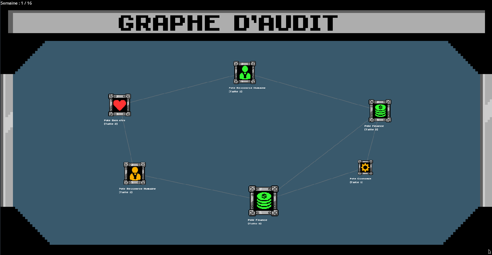
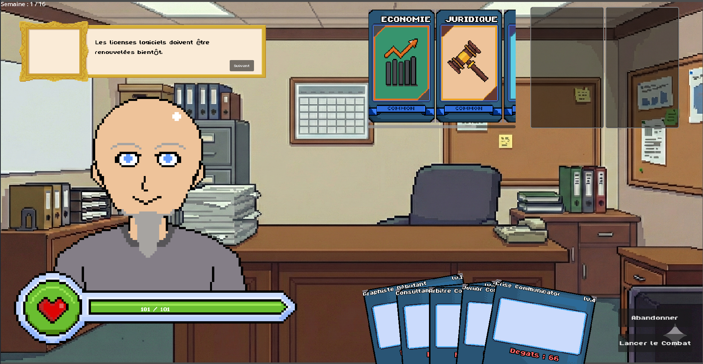
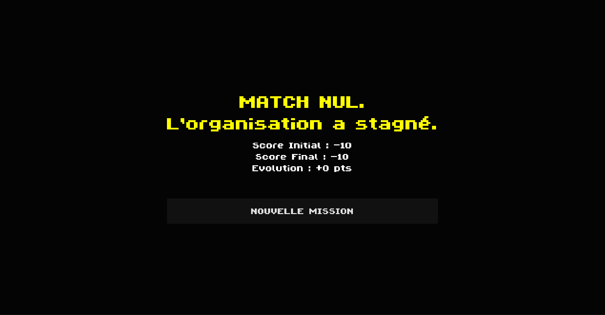
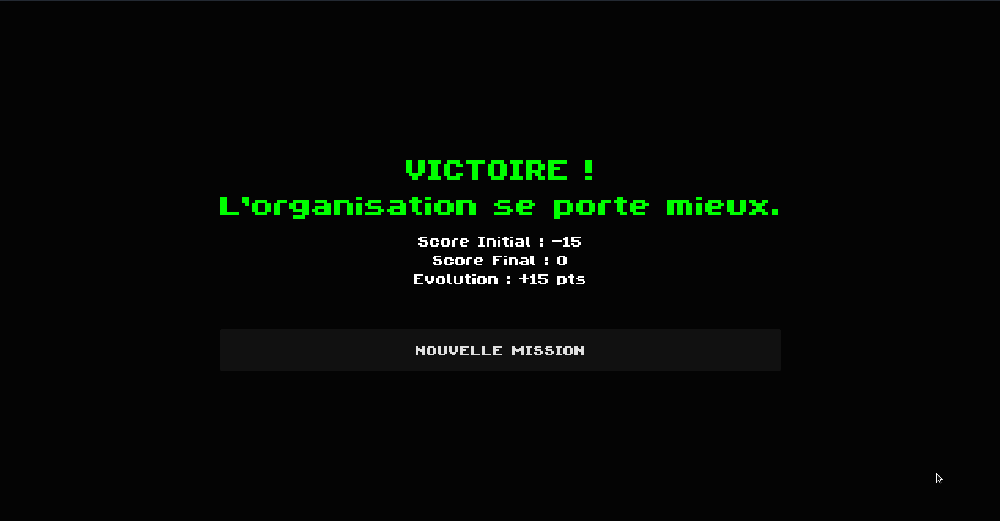
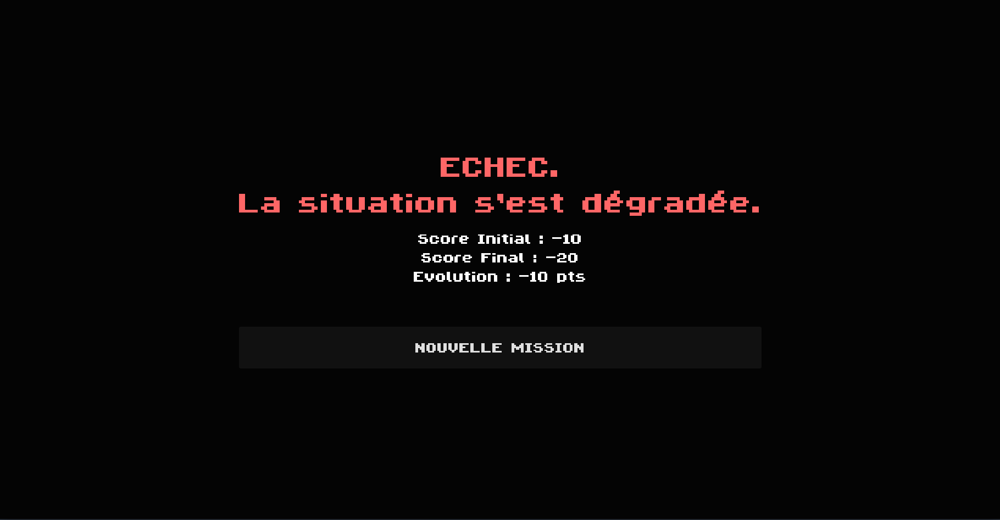

# Wiki - Manuel de Jeu
---

Bienvenue sur le wiki ! Vous trouverez ici toutes les informations essentielles concernant notre jeu.

### Les objectifs pédagogiques

Notre jeu propose plusieurs objectifs pédagogiques centrés sur la **planification** d'un audit :

- Identifier et prioriser quel pôle ou partie de l'organisation auditer.
- Comprendre l'acquisition de connaissances grâce à l'expérience.
- Choisir des actions proportionnées à la situation et aux compétences disponibles.

### Description avancée du jeu

Notre projet est un jeu de cartes et de stratégie. Il s'inspire des mécaniques de TCG / JCC (Jeu de Cartes à Collectionner) tels que *Magic*, *Hearthstone* ou *Slay the Spire*.

Le joueur gère 2 types de cartes :
- **Les cartes "Compétence" :** Elles reflètent l'expertise de l'auditeur (Économie, Juridique, Communication). Elles possèdent un niveau allant de 1 à 4.
- **Les cartes "Action" (ou Combat) :** Ce sont les cartes utilisées pour "attaquer" (auditer) un pôle. Chaque carte possède un niveau de compétence requis, ainsi qu'une puissance d'impact.

### Actions du joueur

Au lancement du jeu, le joueur arrive sur l'écran du **Graphe des Services**, qui visualise la situation globale de l'organisation. L'état de chaque pôle est indiqué par sa couleur et sa taille.

Depuis cet écran, le joueur choisit quel pôle auditer en cliquant dessus, ce qui lance la phase d'audit (combat).

Sur cet écran :
1. Les cartes "Compétence" sont en haut (Main Deck).
2. Les cartes "Action" sont en bas (Main Hand).

Le joueur choisit jusqu'à 2 cartes "Compétence" et les glisse dans les emplacements prévus (slots). Une mécanique clé permet de **fusionner** deux cartes de même type et de même niveau pour en créer une de niveau supérieur, débloquant ainsi l'utilisation de cartes Action plus puissantes.

**Abandon tactique :**
Pendant l'audit, le joueur peut décider d'abandonner à tout moment. Cela laisse l'état du pôle inchangé (pas de dégâts), mais permet d'obtenir de nouvelles cartes, simulant l'expérience acquise (à condition d'avoir joué au moins un tour et ne pas avoir fui immédiatement).

### Fin du jeu

Une fois les 16 semaines (tours de jeu globaux) écoulées, un écran de fin apparaît. Il présente un bilan comparatif de l'organisation "avant/après" le passage de l'auditeur.

Le résultat se décline en 3 variantes selon la performance :

  
  
  

